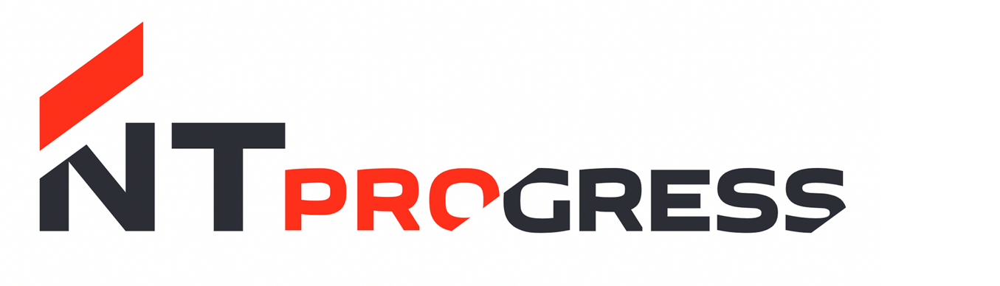

# Test task NTPRO stock trading application



## 📊 Overview

This is a simple stock exchange application with a client-server architecture, developed as a test task for NTPRO. The exchange trades USD for RUB, matching buy and sell orders from multiple clients.

## 🚀 Features

- **Multi-client support**: The server can handle multiple client connections simultaneously.
- **Order placement**: Clients can place buy or sell orders for USD/RUB.
- **Balance checking**: Clients can view their current balance.
- **Automatic order matching**: The server automatically matches orders when prices intersect.
- **Partial order execution**: Orders can be partially filled.
- **Real-time trading**: Orders are active until fully executed.
- **Unlimited balance**: Clients can trade with negative balances.

### 🎈 Bonus Features

- View active orders 📋
- View completed trades 🛂
- View quote history 📈
- Cancel active orders 🚫
- PostgreSQL database integration for order and trade history 💽
- Client authentication with password 🔑

## 🛠 Prerequisites

- CMake (version 3.21 or higher)
- C++17 compatible compiler
- Docker and Docker Compose
- Boost (version 1.40 or higher)
- Protobuf
- PostgreSQL client libraries
- GTest

## 🔧 Building the Project

### 📎 Initialize and update submodules
```bash
git submodule update --init --recursive
```

### 💼 Create dir and build all
```bash
mkdir build && cd build
cmake .. --target all
```

### 🚀 Run database
```bash
docker compose up --build -d
```
### 🚀 Run server
```bash
./build/server/server
```

### 🚀 Run client
```bash
./build/client/client
```

### 🧪 Run tests
```bash
./build/tests/trade_tests
```